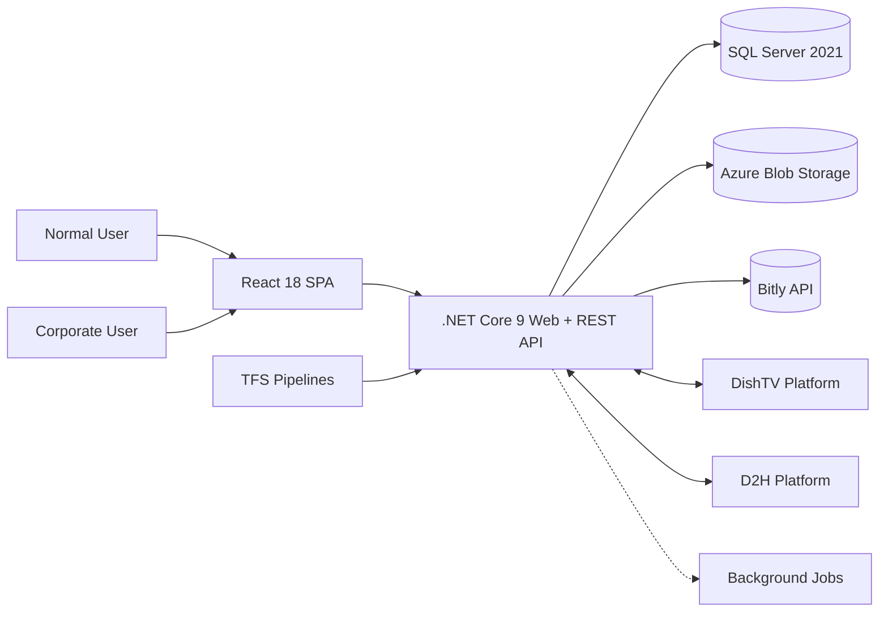

# Phoenix & Watcho — High‑Level Design (HLD)

## 1. Goals & Non‑Functional Requirements
**Goals:** Unified portal for subscribers & leads, role‑aware UX, plan validation, payment links, and platform sync (DishTV/D2H).  
**NFRs:** 99.9% availability; P95 read < 300 ms; secure by default (TLS 1.2+, RBAC, secret management); observability (logs/metrics/traces); scale to peak campaign loads.

## 2. System Context (C4‑L1)

## 3. Logical Architecture (C4‑L2)
- **Web UI (React 18):** Authentication, subscriber search (by VC), package configurator, lead flows, payment initiation.
- **API (.NET Core 9):** AuthN/Z, validation, orchestration, domain services, integration adapters.
- **Domain Services:** Subscriber, Plan/Package, Lead, PaymentLink, Sync (DishTV/D2H), Media, Notification.
- **Data & Storage:** SQL Server via EF Core/Repositories; Azure Blob via Client SDKs.
- **External Integrations:** Bitly (short links), Payment Gateway (redirect + webhooks), DishTV/D2H (partner sync APIs).
- **Background Jobs:** Reconciliation, sync retries, stale‑lead nudges, invoice/emailers.

## 4. Key Use‑Case Flows
1. **Fetch Subscriber** by VC → show current package & billing → allow change with validation.  
2. **Configure Package** via dropdowns → dynamic combinations & eligibility → confirm & apply.  
3. **Lead Lifecycle** → create/update/dispose → recommend packages → generate **Bitly** payment link → redirect to PG → webhook → convert lead.  
4. **DishTV/D2H Sync** → decoupled connectors, idempotent operations, reconciliation.

## 5. Security & Compliance
- **RBAC** for Normal vs Corporate roles; **JWT**/cookies; **least‑privilege**.
- **Azure Client SDKs** with secure credentials; **Key Vault/secret rotation**.
- **Input validation** (server & client), **reCAPTCHA** (if public forms), **OWASP** controls.
- **At‑rest:** TDE for SQL, SSE for Blob; **in‑transit:** TLS 1.2+.

## 6. Deployment & DevOps
- **TFS CI/CD:** automated build, tests, artifact publish; environment variables per stage; approvals.
- **Scalability:** horizontal app scaling; queue/backoff for partner APIs; caching for plan catalogs.
- **Observability:** structured logs, metrics (latency/error rate), traces; dashboards & alerts.

## 7. High‑Level Data Model
**Subscriber**, **Plan**, **PackageChange**, **Lead**, **PaymentLink**, **SyncJob**, **AuditLog**.

## 8. Risks & Mitigations
- Partner throttling → **circuit breaker + backoff**; cache plan catalogs.  
- Webhook loss → **signed, retryable webhooks** + dead‑letter.  
- Cross‑platform data drift → nightly **reconciliation** & diff reports.
