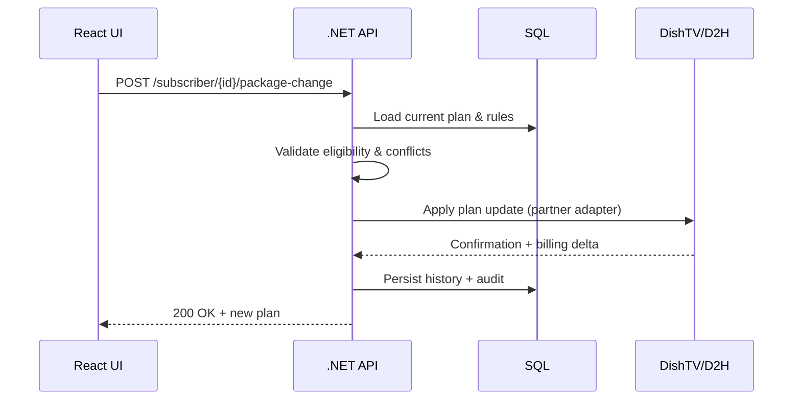
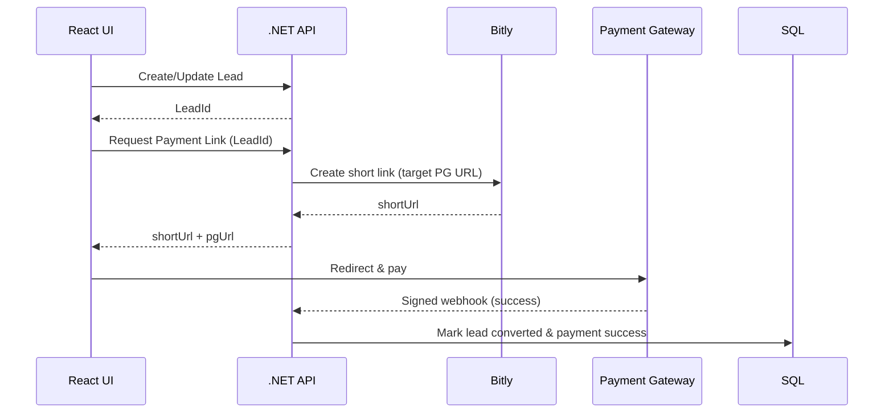

# Phoenix & Watcho — Low‑Level Design (LLD)

## 1. Entities & Tables (Relational)
```
Subscriber(SubscriberId PK, VCNumber UQ, Name, Email, Phone, Status, CurrentPlanId, BillingCycle, CreatedOn)
Plan(PlanId PK, Name, Tier, Price, ValidityDays, RulesJson)
SubscriberPlanHistory(Id PK, SubscriberId FK, PlanId FK, FromAt, ToAt, Reason)
PackageChange(Id PK, SubscriberId FK, OldPlanId, NewPlanId, RequestedBy, Status, AuditJson, CreatedAt)
Lead(LeadId PK, Source, Segment, Status, OfferSetJson, Owner, NextActionAt, Amount)
PaymentLink(Id PK, RefType, RefId, ShortUrl UQ, TargetUrl, Amount, Currency, Status, PGRef, ExpiresAt)
SyncJob(Id PK, Direction, EntityType, PayloadRef, Status, RetryCount, LastError, NextRun)
AuditLog(Id PK, Actor, Action, Entity, EntityId, At, DiffJson, CorrelationId)
```

## 2. Core APIs
| Method | Endpoint | Purpose |
|---|---|---|
| GET | `/api/subscribers?vc=XXXX` | Fetch subscriber by VC Number |
| POST | `/api/subscribers/{id}/package-change` | Validate + apply plan change |
| GET | `/api/plans` | List plans & valid combinations |
| POST | `/api/leads` | Create lead |
| PATCH | `/api/leads/{id}` | Update/dispose lead |
| POST | `/api/payments/links` | Create Bitly short link & PG target |
| POST | `/api/payments/webhook` | Handle PG callback (signed) |
| GET | `/api/sync/status/{entity}/{id}` | Sync health & reconciliation status |

**Contract Example**
```json
POST /api/payments/links
{ "refType": "Lead", "refId": "L-2025-01001", "amount": 799.00, "currency": "INR", "returnUrl": "https://phoenix/app/checkout/return" }

200 OK
{ "shortUrl": "https://bit.ly/abcd", "pgUrl": "https://pg/checkout/tx_123", "status": "Created", "expiresAt": "2025-10-31T18:00:00Z" }
```

## 3. Service/Class Design (C# Sketches)
```csharp
public record Subscriber(string Id, string VCNumber, string? PlanId, BillingInfo Billing, Status Status);
public record Lead(string Id, LeadStatus Status, string OfferSetJson, decimal? Amount);

public interface ISubscriberService {
    Task<SubscriberDto> GetByVCAsync(string vc);
    Task<PackageChangeResult> ChangePlanAsync(string subscriberId, string newPlanId, string requestedBy);
}

public interface ILeadService {
    Task<string> CreateAsync(CreateLeadRequest req);
    Task UpdateAsync(string id, UpdateLeadRequest req);
}

public interface IPaymentLinkService {
    Task<PaymentLinkDto> CreateAsync(PaymentLinkRequest req);
}

public interface ISyncConnector {
    Task PushAsync<T>(T payload, string correlationId, CancellationToken ct);
}
```

## 4. Sequence Diagrams
**Package Change**


**Lead → Payment**


## 5. Frontend Notes (React 18)
- **State:** React Query/Zustand for server cache & UI state.
- **Forms:** React Hook Form + Zod/Yup for package validation.
- **UI:** Accessible dropdowns for combos; optimistic updates for lead ops; toast notifications.

## 6. Validation & Error Model
- FluentValidation/DataAnnotations; problem‑details responses; consistent error codes.
- **Idempotency keys** for package changes & payments; **retry‑safe** operations.
- **Rate‑limiting** & **circuit breakers** around partner APIs.

## 7. Test Strategy
- **Unit:** domain services, validators, adapters.
- **Contract:** OpenAPI + Pact for partner connectors.
- **Integration:** EF Core + localdb/containers; Bitly sandbox mocks.
- **E2E:** Playwright/Cypress; post‑deploy smoke in TFS pipeline.
